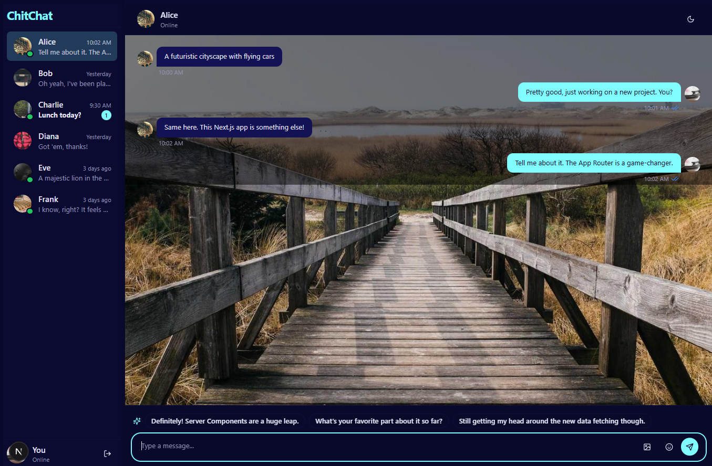
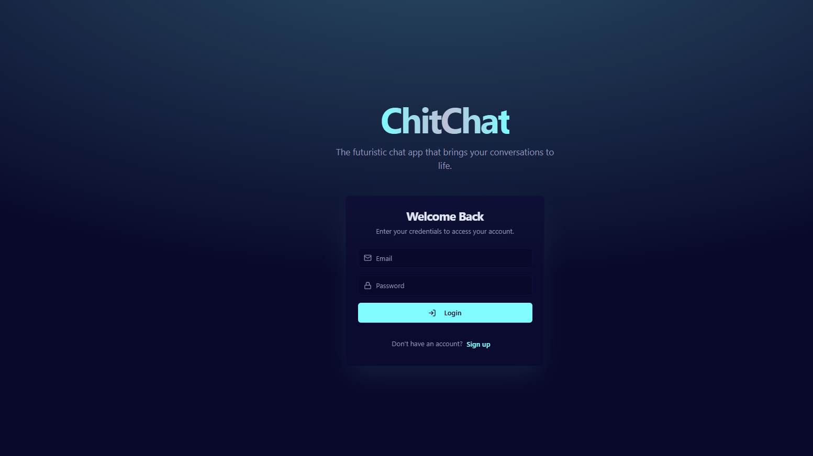

# ChitChat

ChitChat is a modern, AI-powered chat application built with Next.js, Genkit AI, and TailwindCSS. It provides smart reply suggestions, real-time chat features, and a sleek user interface.

## Features

- **AI-Powered Smart Replies**: Generate context-aware reply suggestions using Genkit AI.
- **Real-Time Chat**: Seamless communication with real-time updates.
- **Responsive Design**: Optimized for both desktop and mobile devices.
- **Customizable Themes**: Switch between light and dark modes.
- **Secure Authentication**: Firebase integration for user authentication.

## Screenshots

### Chat Interface


### Login Page


## Tech Stack

- **Frontend**: Next.js, React, TailwindCSS
- **Backend**: Genkit AI, Firebase
- **Languages**: TypeScript
- **Other Tools**: Radix UI, Zod, Framer Motion

## Prerequisites

- Node.js (v18 or higher)
- npm or yarn
- Firebase project setup (for authentication)
- Genkit AI API key

## Installation

1. Clone the repository:
   ```bash
   git clone https://github.com/SrinivasProjects/ChitChat.git
   cd ChitChat
   ```

2. Install dependencies:
   ```bash
   npm install
   ```

3. Set up environment variables:
   - Create a `.env` file in the root directory.
   - Add the following variables:
     ```env
     NEXT_PUBLIC_FIREBASE_API_KEY=your_firebase_api_key
     NEXT_PUBLIC_FIREBASE_AUTH_DOMAIN=your_firebase_auth_domain
     NEXT_PUBLIC_GENKIT_API_KEY=your_genkit_api_key
     ```

4. Start the development server:
   ```bash
   npm run dev
   ```

## Scripts

- `npm run dev`: Start the development server.
- `npm run build`: Build the application for production.
- `npm run start`: Start the production server.
- `npm run lint`: Run ESLint to check for code quality.
- `npm run typecheck`: Check for TypeScript errors.

## Project Structure

- **src/**: Contains the source code.
  - **ai/**: AI-related logic and flows.
  - **app/**: Next.js app directory.
  - **components/**: Reusable UI components.
  - **hooks/**: Custom React hooks.
  - **lib/**: Utility functions and libraries.
  - **public/**: Static assets.
- **.env**: Environment variables.
- **package.json**: Project metadata and dependencies.

## AI Integration

The `smart-reply-suggestions.ts` file defines the logic for generating smart reply suggestions using Genkit AI. It uses the following schemas:

- **Input Schema**:
  ```typescript
  chatHistory: string; // The complete chat history as a single string.
  numberOfSuggestions: number; // Number of suggestions to generate.
  ```

- **Output Schema**:
  ```typescript
  suggestions: string[]; // Array of smart reply suggestions.
  ```

## Contributing

Contributions are welcome! Please fork the repository and submit a pull request.

## License

This project is licensed under the MIT License. See the LICENSE file for details.

## Acknowledgments

- [Next.js](https://nextjs.org/)
- [Genkit AI](https://genkit.ai/)
- [TailwindCSS](https://tailwindcss.com/)
